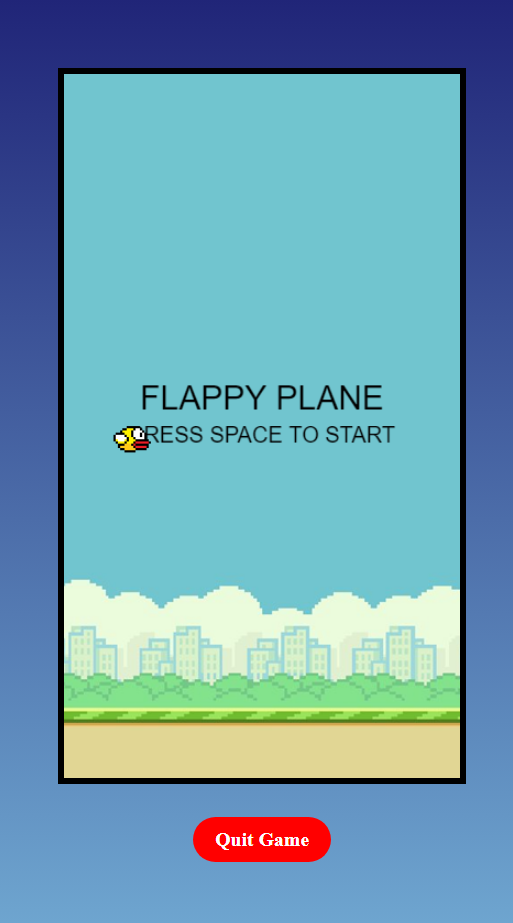
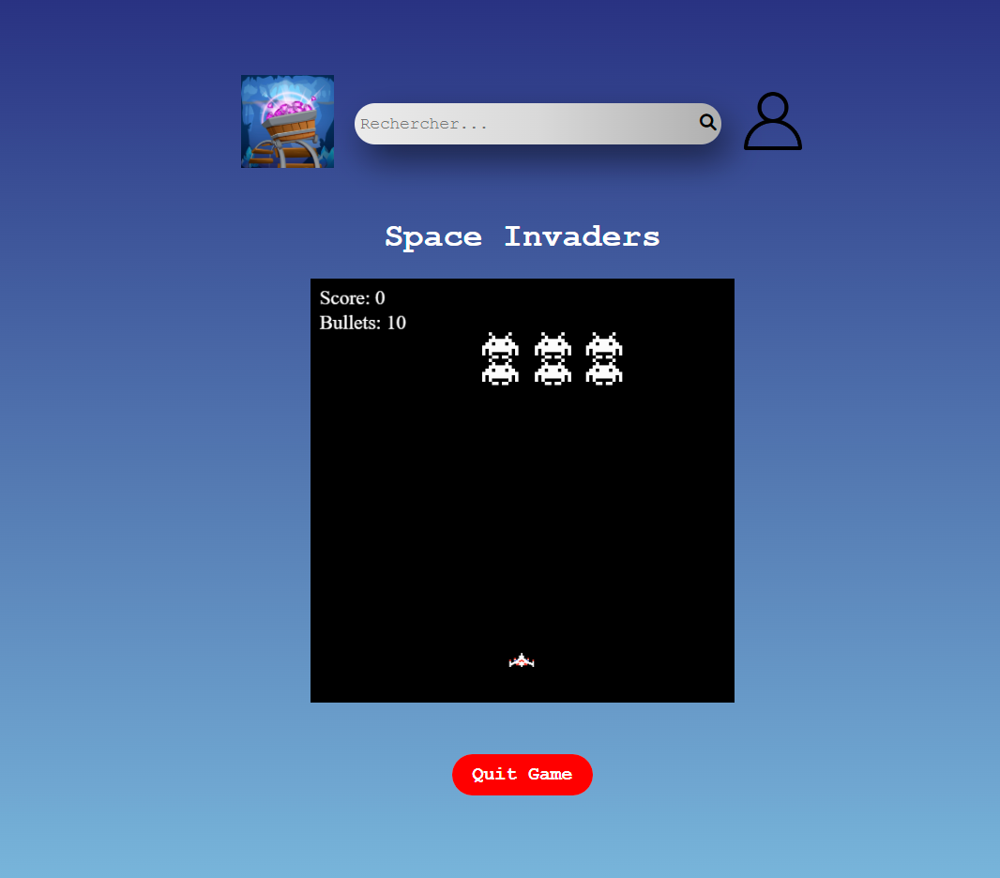

# Minis Jeux JS - Documentation

Projet réalisé en binôme.

## Sommaire
I. [Rappel du Projet](#i-rappel-du-projet)  
II. [Cadre de développement](#ii-cadre-de-développement)  
III. [Stack Technique](#iii-stack-technique)  
IV. [Comment installer le projet](#iv-comment-installer-le-projet)  
V. [Utilisation](#v-utilisation)  
VI.[Axes d'améliorations](#vi-axes-damélioration)  
VII. [Visuels de l'application web](#vii-visuels-de-lapplication-web)  
VIII. [Remerciements](#viii-remerciements)  

## I. Rappel du Projet

Ce projet consistait a créer un site web permettant de jouer à des minis jeux, tous codés en JavaScript.  

L'ensemble du projet devait être développé par groupe de 2 personnes, avec un site contenant au moins 3 jeux de difficultés différentes, 
un affichage des meilleurs scores et un menu de sélection des jeux.

## II. Cadre de développement

- **Établissement** : Rennes Ynov Campus
- **Niveau d'études** : Première année en Bachelor Informatique
- **Contraintes** :
    * 2 semaines
    * Travail en binôme
    * Créer un site web
    * Créer au moins 3 jeux
    * Affichage des meilleurs scores
    * Interfaces réactives

## III. Stack Technique

- **Langages** : JavaScript et HTML/CSS 

## IV. Comment installer le projet

### 1 - Prérequis

Installer un logiciel qui permets de créer un environnement de serveur local tel XAMPP, WAMP,...

### 2 - Cloner le répertoire

Placez-vous dans le dossier adéquat, pour xampp dans **htdocs** par exemple.
Ouvrez ensuite vôtre cmd, VisualStudioCode, ou votre IDE habituel, puis utilisez la commande ``git clone https://github.com/Elouanche/Mini_Jeux_en_JS.git``.

## V. Utilisation

Lancez votre logiciel et démarrez le module **Apache** en appuyant sur *Start*.  
Ouvrez votre navigateur, puis tapez **[localhost/mini-jeux-js](http://localhost/mini-jeux-js/)**

## VI. Axes d'amélioration
   - Ajout d'une barre de recherche fonctionnelle 
   - Ajout d'une fonctionnalité de création de compte.

## VII. Visuels de l'application web

Voici l'interface générale de votre mini-jeux-js :  

* Et voici quelques jeux : 

## VIII. Remerciements

Nous vous remercions d'avoir essayé notre projet en espérant que cela vous a plu !
